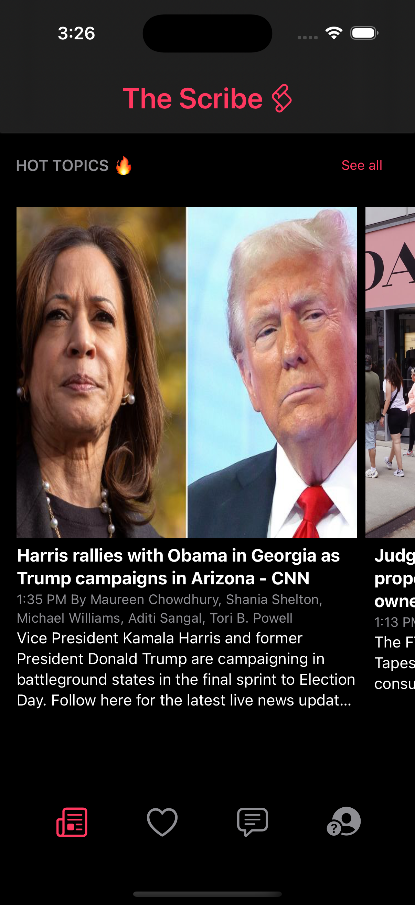
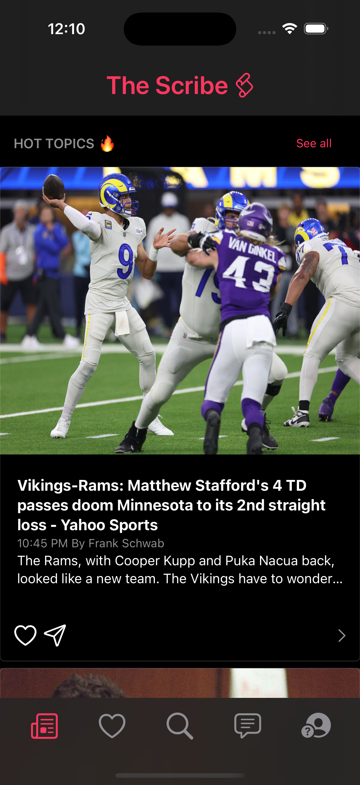
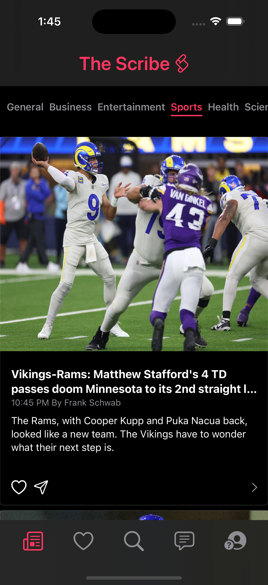

# thescribe-v2

## Initial Mockup

I have implemented the logic to get the recent breaking news from a third party news api and display it in a scrollable view as seen below.

## Updated UI

I updated the UI to pivot in the direction of creating a news app that has an instagram type feel to it

##

Implemented an enum to store the different endpoints for each type of news is to be shown, the logic to let the user update the type of news they are looking at and refetching the correct data when that happens and also implemented matched geometry on the indicator bar for a smooth transition between views

